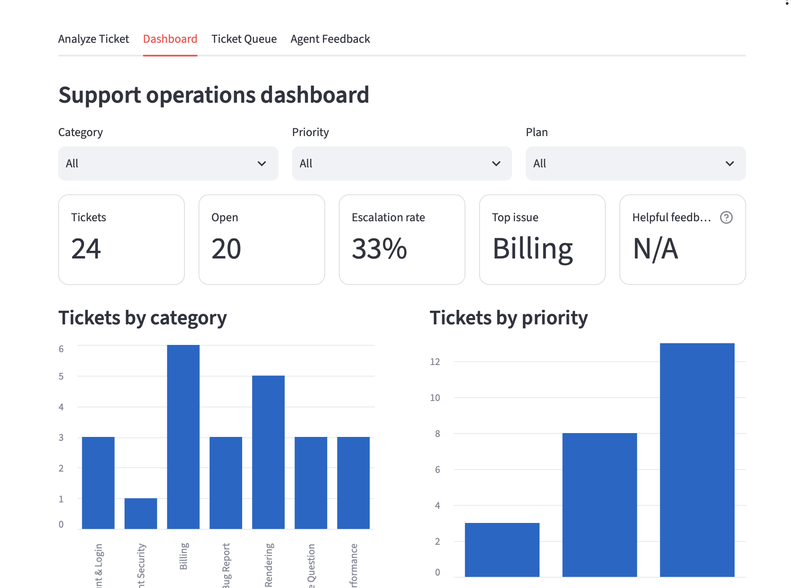
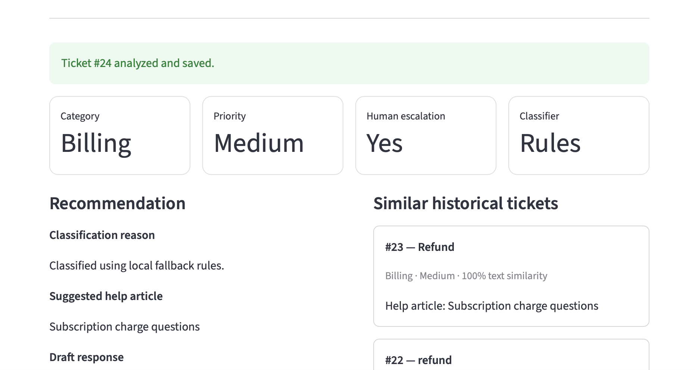
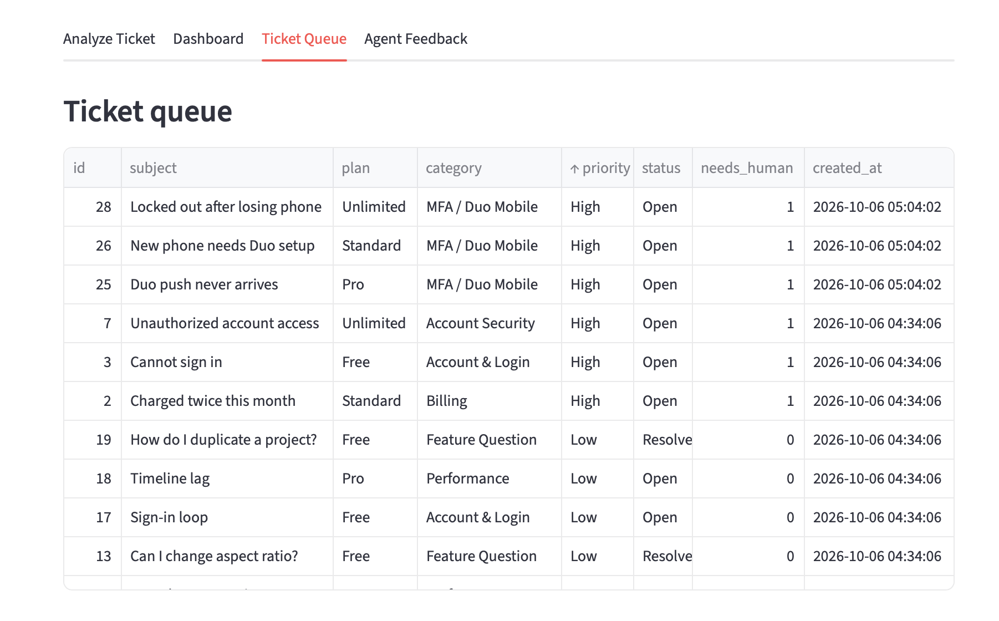

# Support Triage & Insights

A portfolio-ready customer support operations project built with Python, Streamlit, SQLite, and an optional OpenAI API integration.

The project models a realistic support workflow rather than a fully autonomous chatbot. A support agent can submit a ticket, review its category and escalation recommendation, compare it with similar historical tickets, inspect a matching knowledge-base article, review a draft response, and rate whether the recommendation was useful.

## Features

- Ticket intake with customer plan context
- Rule-based ticket classification that works without external APIs
- Optional OpenAI-assisted classification
- Priority and human-escalation recommendations
- MFA / Duo Mobile escalation examples for account-access issues
- Similar historical ticket retrieval using local text similarity
- Knowledge-base matching
- Draft support responses
- Agent feedback: Helpful / Not Helpful + notes
- SQLite ticket and feedback history
- Filterable support dashboard
- Feedback helpfulness metric
- Synthetic seed data for demonstration
- Render deployment configuration

## Tech stack

- Python
- Streamlit
- SQLite
- pandas
- OpenAI API (optional)

## Demo

### Support Operations Dashboard



The dashboard provides a high-level view of support activity, including total and open ticket volume, escalation rate, the most common issue category, category distribution, and priority distribution. Filters allow the queue to be narrowed by category, priority, and customer plan.

### Ticket Triage and Recommendation



A submitted support request is classified by category and priority, evaluated for human escalation, matched to a relevant help article, and compared against similar historical tickets. The result keeps the recommendation reviewable instead of automatically taking account-level action.

### MFA / Duo Mobile Escalation Queue



The ticket queue stores analyzed requests with their plan, category, priority, status, escalation decision, and creation time. MFA / Duo Mobile cases such as a lost phone, new-device enrollment, or a failed Duo push are marked high priority and routed for human review because they can require identity verification or account-specific authentication changes.

## Project structure

```text
ai-support-triage/
├── app.py
├── analytics.py
├── classifier.py
├── database.py
├── knowledge_base.py
├── similarity.py
├── render.yaml
├── requirements.txt
├── .env.example
├── .gitignore
├── data/
│   ├── tickets.csv
│   └── knowledge_base.json
├── docs/
│   └── screenshots/
│       ├── dashboard-overview.png
│       ├── ticket-analysis.png
│       └── ticket-queue-duo.png
└── tests/
    ├── conftest.py
    ├── test_classifier.py
    ├── test_knowledge_base.py
    └── test_similarity.py
```

## Run locally

Create a virtual environment:

```bash
python3 -m venv .venv
source .venv/bin/activate
```

On Windows:

```bash
.venv\Scripts\activate
```

Install dependencies:

```bash
pip install -r requirements.txt
```

Start the app:

```bash
streamlit run app.py
```

The app works immediately with the local rule-based classifier.

## Optional OpenAI integration

Copy the example environment file:

```bash
cp .env.example .env
```

Then add your API key and a model available to your OpenAI API account:

```text
OPENAI_API_KEY=your_key_here
OPENAI_MODEL=your_model_here
```

Do not commit `.env` or an API key to GitHub.

If either environment variable is missing, the project automatically falls back to the local classifier.

## Similar-ticket retrieval

The project uses a lightweight local text-similarity implementation to compare a new request against historical ticket subjects and descriptions. It intentionally avoids a heavy vector database for the MVP while still demonstrating retrieval and case reuse.

## Agent feedback

After a ticket is analyzed, an agent can mark the recommendation as **Helpful** or **Not helpful** and leave an optional note. The dashboard tracks the percentage of feedback marked helpful so recommendation quality can be measured rather than assumed.

## Run tests

```bash
pytest
```

## Deploy on Render

The repository includes `render.yaml` for a simple web-service deployment.

The app runs without an OpenAI API key. If you want model-assisted classification in a hosted demo, add `OPENAI_API_KEY` and `OPENAI_MODEL` as environment variables in the hosting platform rather than committing them to the repository.

The demo currently uses a local SQLite database. On an ephemeral hosting instance, newly submitted tickets and feedback may reset when the service is rebuilt or restarted. The synthetic seed data will repopulate automatically.

## Portfolio talking points

This project demonstrates:

- support triage and escalation logic
- retrieval of similar previously seen issues
- self-service documentation matching
- human-in-the-loop AI workflows
- MFA / Duo Mobile escalation handling
- support analytics and recurring issue identification
- feedback collection for measuring recommendation quality

## Next improvements

- semantic knowledge-base search with embeddings
- weekly category trend comparisons
- classification evaluation dataset and precision/recall metrics
- CSV import/export
- public deployment link
